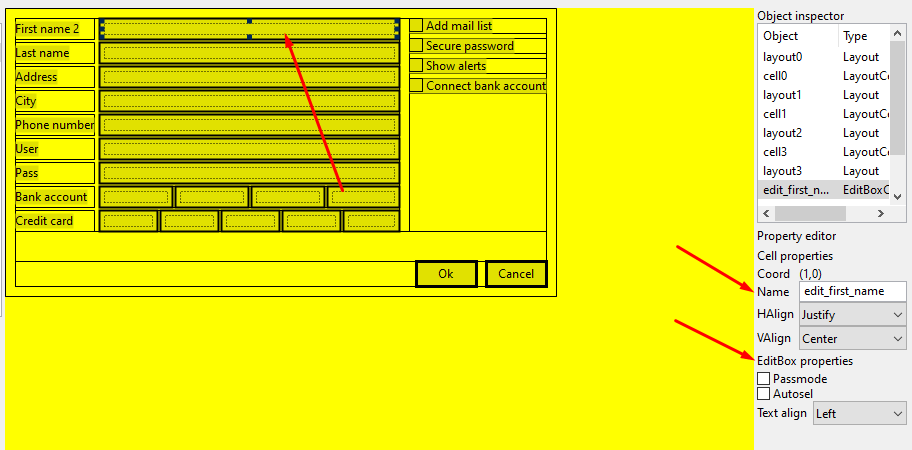
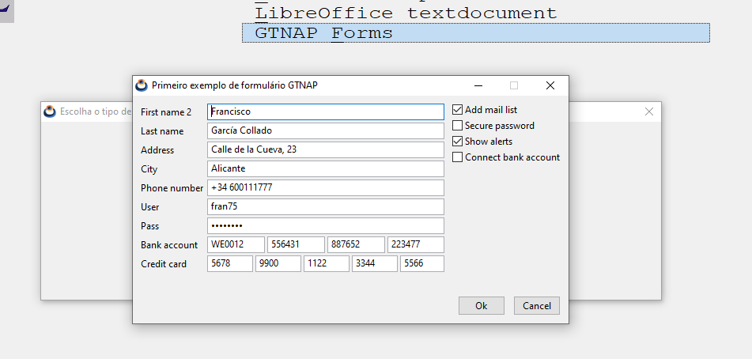

# GTNAP-Forms

GTNAP-Forms is a set of Harbour functions, integrated into GTNAP, that allow us to load and run forms created with [NapDesigner](./Readme.md).

## Build GTNAP-Forms

GTNAP-Forms is built into GTNAP, extending its API, so we don't have to do anything special to compile it. Just run the build script in `contrib\gtnap`. More information at [Build GTNAP](../Readme.md#build-gtnap).

```
cd contrib/gtnap

:: Windows MinGW
build.bat -b [Debug|Release] -comp mingw64

:: Linux/macOS
bash ./build.sh -b [Debug|Release]
```
## Load a form

NapDesigner creates `*.nfm` (NAppGUI forms) files that can be loaded at runtime. In [exemploforms.prg](../tests/cuademo/gtnap_cualib/exemploforms.prg) you have the complete example.

### NAP_FORM_LOAD

Load a form from a file on disk.

```
LOCAL V_FORM := NAP_FORM_LOAD(DIRET_FORMS() + "Customer.nfm")

PAR1: Path to the file containing the form.
RET: Form object.
```

### NAP_FORM_TITLE

Set a title for the form window.

```
NAP_FORM_TITLE(V_FORM, "Primeiro exemplo de formulário GTNAP")

PAR1: Form object.
PAR2: Text string with the title.
```
### NAP_FORM_MODAL

Launch the form in modal mode.

```
N_RES := NAP_FORM_MODAL(V_FORM)

PAR1: Form object.
RET: Numeric value with the result at the close of the form. These values ​​can be:
    - NAP_MODAL_ENTER (2). The form has been closed by pressing the [RETURN] key.
    - NAP_MODAL_ESC (1). The form has been closed by pressing the [ESC] key.
    - NAP_MODAL_X_BUTTON (3). The form has been closed by clicking the [X] icon in the window.
    - OTHER. The form has been closed by NAP_FORM_STOP_MODAL()
```

### NAP_STOP_MODAL

Forces a form launched via `NAP_FORM_MODAL()` to close. This function must be invoked by some callback function, in response to any GUI event (for example, pressing a button).

```
NAP_FORM_ONCLICK(V_FORM, "button_ok", {|| NAP_FORM_STOP_MODAL(V_FORM, 1000) })

PAR1: Form object.
PAR2: Numeric value to return as a response in NAP_FORM_MODAL().
```
## Data binding

To make the form really practical, we need to be able to connect variables in the Harbour part to the GUI controls (widgets). The first thing is to give a unique and recognizable **ID** in NapDesign to the cells that contain the widgets that we are interested in connecting. For example, the _Editbox_ with the user's name (`edit_first_name`).



In the Harbour part, we need to create a vector of pairs (ID-variable). The `ID` is the name of the widget previously assigned in NApDesign, which will be in charge of editing the value of the `variable`.

```
LOCAL C_NAME := "Francisco"
LOCAL C_LAST := "García Collado"
LOCAL C_ADDRESS := "Calle de la Cueva, 23"
LOCAL C_CITY := "Alicante"
LOCAL C_PHONE := "+34 600111777"
LOCAL C_USER := "fran75"
LOCAL C_PASS := "pass5566"
LOCAL C_BANK := {"WE0012", "556431", "887652", "223477"}
LOCAL C_CARD := {"5678", "9900", "1122", "3344", "5566"}
LOCAL L_MAIL_LIST := .T.
LOCAL L_SECURE_PASS := .F.
LOCAL L_SHOW_ALERTS := .T.
LOCAL L_CONNECT_BANK := .F.
// Mapping between Harbour variables and form control names
LOCAL V_BIND := { ;
                    {"edit_first_name", @C_NAME }, ;
                    {"edit_last_name", @C_LAST }, ;
                    {"edit_address", @C_ADDRESS }, ;
                    {"edit_city", @C_CITY }, ;
                    {"edit_phone", @C_PHONE }, ;
                    {"edit_user", @C_USER }, ;
                    {"edit_pass", @C_PASS }, ;
                    {"edit_bank1", @C_BANK[1] }, ;
                    {"edit_bank1", @C_BANK[1] }, ;
                    {"edit_bank2", @C_BANK[2] }, ;
                    {"edit_bank3", @C_BANK[3] }, ;
                    {"edit_bank4", @C_BANK[4] }, ;
                    {"edit_credit1", @C_CARD[1] }, ;
                    {"edit_credit2", @C_CARD[2] }, ;
                    {"edit_credit3", @C_CARD[3] }, ;
                    {"edit_credit4", @C_CARD[4] }, ;
                    {"edit_credit5", @C_CARD[5] }, ;
                    {"check_mail_list", @L_MAIL_LIST }, ;
                    {"check_secure_pass", @L_SECURE_PASS }, ;
                    {"check_show_alerts", @L_SHOW_ALERTS }, ;
                    {"check_connect_bank", @L_CONNECT_BANK } ;
                }
```

**Form running from Harbour**


If the variable is provided by value it will be read-only. We will see its value in the widget, but the value assigned by the user cannot be recorded. To do this, pass the variable by reference.

### NAP_FORM_DBIND

Binds a vector of pairs (id-variable) to the form.

```
NAP_FORM_DBIND(V_FORM, V_BIND)

PAR1: Form object.
PAR2: Pair vector (id-variable)
```

When the form is launched with `NAP_FORM_MODAL()`, the value of the variables will be automatically mapped to the widgets. If the user changes any value, it will NOT be written back until we call `NAP_FORM_DBIND_STORE()`.

### NAP_FORM_DBIND_STORE

Writes content of form widgets in variables provided by `NAP_FORM_DBIND()`

```
IF N_RES == NAP_MODAL_ENTER .OR. N_RES == 1000
    // Write the values from the GUI controls to Harbour variables
    NAP_FORM_DBIND_STORE(V_FORM)

PAR1: Form object.
```

If the variable was passed by value, it will be impossible to record the changes. Pass a reference to the variable to make it read/write.

## Button events

If the Harbor part wants to perform some action if a button is pressed, it will need to associate a block of code with the component.

### NAP_FORM_ONCLICK

Sets the block of code that will be executed when a button is pressed on the form.

```
NAP_FORM_ONCLICK(V_FORM, "button_ok", {|| NAP_FORM_STOP_MODAL(V_FORM, 1000) })

PAR1: Form object.
PAR2: Button ID.
PAR3: Block of code to be executed in the Harbor part.
```

In this example, clicking the button is associated with closing the form with the return code `1000`.

# Menu API

GTNAP-FORMS includes an API for creating and modifying menus at runtime. A menu can take the role of the application's main menu (menubar) or be launched as a context menu (popup-menu). A menu is made up of several options (MenuItems). A MenuItem, in turn, can contain a submenu, forming a tree-like hierarchy.

## Menu example


```
*******************************************
STAT FUNCTION EXAMPLE_APP_DYN_MENU(V_FORM)
*******************************************
// Main menu
LOCAL O_MAINMENU := NAP_DMENU_CREATE()
// Submenus
LOCAL O_FILEMENU := NAP_DMENU_CREATE()
LOCAL O_NAVMENU := NAP_DMENU_CREATE()
LOCAL O_SERVMENU := NAP_DMENU_CREATE()
LOCAL O_LANGMENU := NAP_DMENU_CREATE()
LOCAL O_HELPMENU := NAP_DMENU_CREATE()
// Items (clickable)
LOCAL O_MAINITEM1 := NAP_DMENUITEM_CREATE("File", NIL, NIL)
LOCAL O_MAINITEM2 := NAP_DMENUITEM_CREATE("Navigate", NIL, NIL)
LOCAL O_MAINITEM3 := NAP_DMENUITEM_CREATE("Server", NIL, NIL)
LOCAL O_MAINITEM4 := NAP_DMENUITEM_CREATE("Language", NIL, NIL)
LOCAL O_MAINITEM5 := NAP_DMENUITEM_CREATE("Help", NIL, NIL)
LOCAL O_FILEITEM1 := NAP_DMENUITEM_CREATE("Open", DIRET_FORMS() + "icons/open.png", {| O_ITEM | ITEM_CLICKED(V_FORM, O_ITEM)})
LOCAL O_FILEITEM2 := NAP_DMENUITEM_CREATE("Save", DIRET_FORMS() + "icons/save.png", {| O_ITEM | ITEM_CLICKED(V_FORM, O_ITEM)})
LOCAL O_FILEITEM3 := NAP_DMENUITEM_CREATE("Exit", DIRET_FORMS() + "icons/exit.png", {| O_ITEM | ITEM_CLICKED(V_FORM, O_ITEM)})
LOCAL O_NAVITEM1 := NAP_DMENUITEM_CREATE("First", DIRET_FORMS() + "icons/first.png", {| O_ITEM | ITEM_CLICKED(V_FORM, O_ITEM)})
LOCAL O_NAVITEM2 := NAP_DMENUITEM_CREATE("Back", DIRET_FORMS() + "icons/back.png", {| O_ITEM | ITEM_CLICKED(V_FORM, O_ITEM)})
LOCAL O_NAVITEM3 := NAP_DMENUITEM_CREATE("Next", DIRET_FORMS() + "icons/next.png", {| O_ITEM | ITEM_CLICKED(V_FORM, O_ITEM)})
LOCAL O_NAVITEM4 := NAP_DMENUITEM_CREATE("Last", DIRET_FORMS() + "icons/last.png", {| O_ITEM | ITEM_CLICKED(V_FORM, O_ITEM)})
LOCAL O_SERVITEM1 := NAP_DMENUITEM_CREATE("Login", DIRET_FORMS() + "icons/login.png", {| O_ITEM | ITEM_CLICKED(V_FORM, O_ITEM)})
LOCAL O_SERVITEM2 := NAP_DMENUITEM_CREATE("Logout", DIRET_FORMS() + "icons/logout.png", {| O_ITEM | ITEM_CLICKED(V_FORM, O_ITEM)})
LOCAL O_SERVITEM3 := NAP_DMENUITEM_CREATE("Settings", DIRET_FORMS() + "icons/settings.png", {| O_ITEM | ITEM_CLICKED(V_FORM, O_ITEM)})
LOCAL O_LANGITEM1 := NAP_DMENUITEM_CREATE("English", DIRET_FORMS() + "icons/usa.png", {| O_ITEM | ITEM_CLICKED(V_FORM, O_ITEM)})
LOCAL O_LANGITEM2 := NAP_DMENUITEM_CREATE("Portuguese", DIRET_FORMS() + "icons/portugal.png", {| O_ITEM | ITEM_CLICKED(V_FORM, O_ITEM)})
LOCAL O_LANGITEM3 := NAP_DMENUITEM_CREATE("Spanish", DIRET_FORMS() + "icons/spain.png", {| O_ITEM | ITEM_CLICKED(V_FORM, O_ITEM)})
LOCAL O_LANGITEM4 := NAP_DMENUITEM_CREATE("Italian", DIRET_FORMS() + "icons/italy.png", {| O_ITEM | ITEM_CLICKED(V_FORM, O_ITEM)})
LOCAL O_LANGITEM5 := NAP_DMENUITEM_CREATE("Japanese", DIRET_FORMS() + "icons/japan.png", {| O_ITEM | ITEM_CLICKED(V_FORM, O_ITEM)})
LOCAL O_LANGITEM6 := NAP_DMENUITEM_CREATE("Russian", DIRET_FORMS() + "icons/russia.png", {| O_ITEM | ITEM_CLICKED(V_FORM, O_ITEM)})
LOCAL O_LANGITEM7 := NAP_DMENUITEM_CREATE("Vietnamese", DIRET_FORMS() + "icons/vietnam.png", {| O_ITEM | ITEM_CLICKED(V_FORM, O_ITEM)})
LOCAL O_HELPITEM1 := NAP_DMENUITEM_CREATE("About", DIRET_FORMS() + "icons/about.png", {| O_ITEM | ITEM_CLICKED(V_FORM, O_ITEM)})

// Add items to each menu
NAP_DMENU_ADD_ITEM(O_FILEMENU, O_FILEITEM1)
NAP_DMENU_ADD_ITEM(O_FILEMENU, O_FILEITEM2)
NAP_DMENU_ADD_ITEM(O_FILEMENU, NAP_DMENUITEM_SEPARATOR())
NAP_DMENU_ADD_ITEM(O_FILEMENU, O_FILEITEM3)

NAP_DMENU_ADD_ITEM(O_NAVMENU, O_NAVITEM1)
NAP_DMENU_ADD_ITEM(O_NAVMENU, O_NAVITEM2)
NAP_DMENU_ADD_ITEM(O_NAVMENU, O_NAVITEM3)
NAP_DMENU_ADD_ITEM(O_NAVMENU, O_NAVITEM4)

NAP_DMENU_ADD_ITEM(O_SERVMENU, O_SERVITEM1)
NAP_DMENU_ADD_ITEM(O_SERVMENU, O_SERVITEM2)
NAP_DMENU_ADD_ITEM(O_SERVMENU, NAP_DMENUITEM_SEPARATOR())
NAP_DMENU_ADD_ITEM(O_SERVMENU, O_SERVITEM3)

NAP_DMENU_ADD_ITEM(O_LANGMENU, O_LANGITEM1)
NAP_DMENU_ADD_ITEM(O_LANGMENU, O_LANGITEM2)
NAP_DMENU_ADD_ITEM(O_LANGMENU, NAP_DMENUITEM_SEPARATOR())
NAP_DMENU_ADD_ITEM(O_LANGMENU, O_LANGITEM3)
NAP_DMENU_ADD_ITEM(O_LANGMENU, O_LANGITEM4)
NAP_DMENU_ADD_ITEM(O_LANGMENU, O_LANGITEM5)
NAP_DMENU_ADD_ITEM(O_LANGMENU, O_LANGITEM6)
NAP_DMENU_ADD_ITEM(O_LANGMENU, O_LANGITEM7)

NAP_DMENU_ADD_ITEM(O_HELPMENU, O_HELPITEM1)

// Link submenus with main menu items
NAP_DMENUITEM_SUBMENU(O_MAINITEM1, O_FILEMENU)
NAP_DMENUITEM_SUBMENU(O_MAINITEM2, O_NAVMENU)
NAP_DMENUITEM_SUBMENU(O_MAINITEM3, O_SERVMENU)
NAP_DMENUITEM_SUBMENU(O_MAINITEM4, O_LANGMENU)
NAP_DMENUITEM_SUBMENU(O_MAINITEM5, O_HELPMENU)

// Add main menu items to main menu
NAP_DMENU_ADD_ITEM(O_MAINMENU, O_MAINITEM1)
NAP_DMENU_ADD_ITEM(O_MAINMENU, O_MAINITEM2)
NAP_DMENU_ADD_ITEM(O_MAINMENU, O_MAINITEM3)
NAP_DMENU_ADD_ITEM(O_MAINMENU, O_MAINITEM4)
NAP_DMENU_ADD_ITEM(O_MAINMENU, O_MAINITEM5)

RETURN O_MAINMENU
```

## Function description

### NAP_DMENU_CREATE

Create a new empty menu.

```
LOCAL O_MENU := NAP_DMENU_CREATE()

RET: The menu object.
```

### NAP_DMENU_DESTROY

Destroy the menu. All items and submenus will be recursively destroyed. The destructor only needs to be called with the main menu.

```
NAP_DMENU_DESTROY(O_MENU)

PAR1: Menu object to destroy.
```

### NAP_DMENU_ADD_ITEM

Adds a new MenuItem at the end of menu.

```
NAP_DMENU_ADD_ITEM(O_MENU, O_ITEM)

PAR1: Menu object.
PAR2: Item object.
```

### NAP_DMENU_INS_ITEM

Inserts a new MenuItem at an arbitrary position in the menu.

```
NAP_DMENU_INS_ITEM(O_MENU, 2, O_ITEM)

PAR1: Menu object.
PAR2: Position (1 = First).
PAR3: Item object.
```

### NAP_DMENU_DEL_ITEM

Removes a MenuItem from its position. The item and all associated submenus will be destroyed.

```
NAP_DMENU_DEL_ITEM(O_MENU, 2)

PAR1: Menu object.
PAR2: Position (1 = First).
```

### NAP_DMENU_COUNT

Returns the number of menu items.

```
LOCAL N_Size := NAP_DMENU_COUNT(O_MENU)

PAR1: Menu object.
RET: The number of menu items.
```

### NAP_DMENU_GET_ITEM

Gets a menuitem from its position.

```
LOCAL O_ITEM := NAP_DMENU_GET_ITEM(O_MENU, 2)

PAR1: Menu object.
PAR2: Position (1 = First).
RET: The MenuItem object.
```

### NAP_DMENU_BAR

Sets a menu as the main menu bar. An active form must be passed, since in Windows and Linux the menubars are linked to a window.

```
NAP_DMENU_BAR(O_MENU, V_FORM)

PAR1: Menu object. If NIL, any previous menubar will be unlinked from the form.
PAR2: Parent GTNAP-Form.
```

### NAP_DMENU_IS_MENUBAR

Returns .T. if the menu is currently set as the main menu bar.

```
LOCAL L_ISBAR := NAP_DMENU_IS_MENUBAR(O_MENU)

PAR1: Menu object. If NIL, any previous menubar will be unlinked from the form.
```

### NAP_DMENU_POPUP

Launches a menu as a pop-up (contextual menu). The menu must NOT have the role of menubar.

```
NAP_DMENU_POPUP(O_MENU, V_FORM, 200, 100)

PAR1: Menu object.
PAR2: Parent form.
PAR3: X coordinate of left-top corner in screen space.
PAR4: Y coordinate of left-top corner in screen space.
```

### NAP_DMENUITEM_CREATE

Create a new MenuItem.

```
LOCAL O_OPENITEM := NAP_DMENUITEM_CREATE("Open", "open.png", {| O_ITEM | ITEM_CLICKED(V_FORM, O_ITEM)})

PAR1: Item text.
PAR2: Icon path. If NIL no icon will shown.
PAR3: Code block for click action. A reference to clicked item will always send to the callback.
RET: The MenuItem
```

### NAP_DMENUITEM_SEPARATOR

Create a new separator item.

```
LOCAL O_SEPITEM := NAP_DMENUITEM_SEPARATOR()

RET: The separator MenuItem
```

### NAP_DMENUITEM_SUBMENU

Adds a submenu to a MenuItem

```
NAP_DMENUITEM_SUBMENU(O_ITEM, O_SUBMENU)

PAR1: The MenuItem
PAR2: The submenu to add.
```

### NAP_DMENUITEM_GET_TEXT

Gets the current text of a menu item.

```
LOCAL C_TEXT := NAP_DMENUITEM_GET_TEXT(O_ITEM)

PAR1: The MenuItem
RET: The current text.
```

### NAP_DMENUITEM_GET_SUBMENU

Gets the current submenu of a menu item.

```
LOCAL O_SUBMENU := NAP_DMENUITEM_GET_SUBMENU(O_ITEM)

PAR1: The MenuItem
RET: The current submenu.
```
