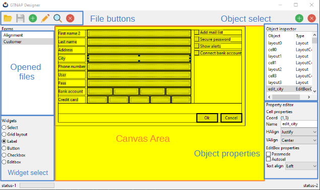
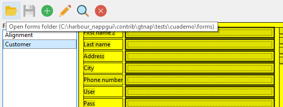
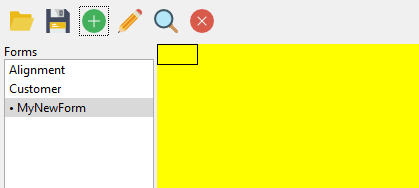

# NAppGUI designer and GTNAP-Forms

NAppGUI Designer es una herramienta visual para diseñar interfaces de usuario (formularios) de forma gráfica e interactiva. Estos formularios se guardarán en archivos que podrán ser cargados en tiempo de ejecución desde Harbour, utilizando GTNAP. Se ha desarrollado utilizando NAppGUI-SDK y los formularios que crea también utilizan NAppGUI para .... dentro de la aplicación final (https://nappgui.com).

## Vista general de NApDesigner

En principio, la apariencia de la aplicación es muy parecida a la de otras herramientas similares (QTDesigner, por ejemplo). En la parte central tendremos el área de diseño donde visualizamos el formulario en construcción. A la izquierda disponemos de una lista de archivos y un selector de widgets. A la derecha tenemos el inspector de objetos y el editor de propiedades. En la parte superior veremos la típica barra de herramientas para la gestión de archivos y una barra de estado en la parte inferior.



## Compilar NApDesigner

Designer se distribuye como parte de GTNAP, por lo que no hay que hacer nada especial para compilarla, tan solo correr el script de build en `contrib\gtnap`. Mas información en [Build GTNAP](../Readme.md#build-gtnap)

```
:: Windows MinGW
build.bat -b [Debug|Release] -comp mingw64

:: Linux / macOS
bash ./build.sh -b [Debug|Release]
```
La aplicación la tendremos en `build/[Debug|Release]/bin/napdesign`.

## Abrir carpeta de proyecto

La primera vez que arranca la aplicación tendremos un área de dibujo en blanco y todos los botones apagados. Lo primero que tenemos que hacer es pulsar sobre el icono carpeta (??) y seleccionar un directorio de proyecto. NApDesigner permite editar simultáneamente todos los formularios de una carpeta determinada. La carpeta actual la podemos ver situando el ratón encima del icono. Haciendo clic sobre cualquier archivo, lo deseccionaremos y veremos en el área de dibujo.



## Crear un nuevo formulario

Una vez abierta la carpeta del proyecto, pulsando el botón (?) crearemos un nuevo formulario. Lo único que veremos es un pequeño rectángulo en el área de dibujo que representa un layout de una sola celda.



NAppGUI basa la composición de interfaces de usuario en el concepto de Layout (GridLayout en QtDesigner) que dividirá el espacio en (ncols x nrows) celdas. La diferencia con otras herramientas es que NAppGUI **no soporta elementos flotantes**. Todos los widgets deben estar dentro de una celda en un layout. Como veremos a continuación, la principal ventaja de esto que **no es necesario establecer el marco** (posición y tamaño) de cada elemento, ya que será calculado automáticamente por NAppGUI en función del API nativo (Win32, GTK, Cocoa).