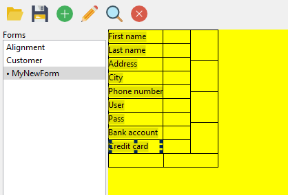
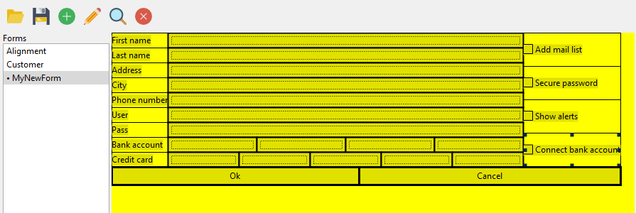
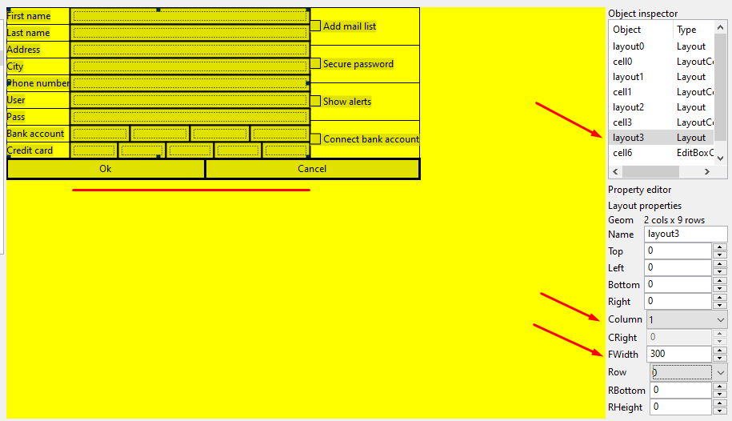
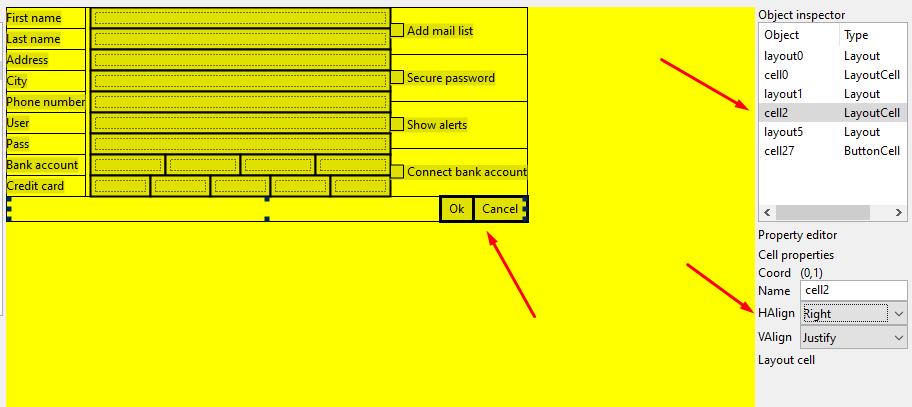
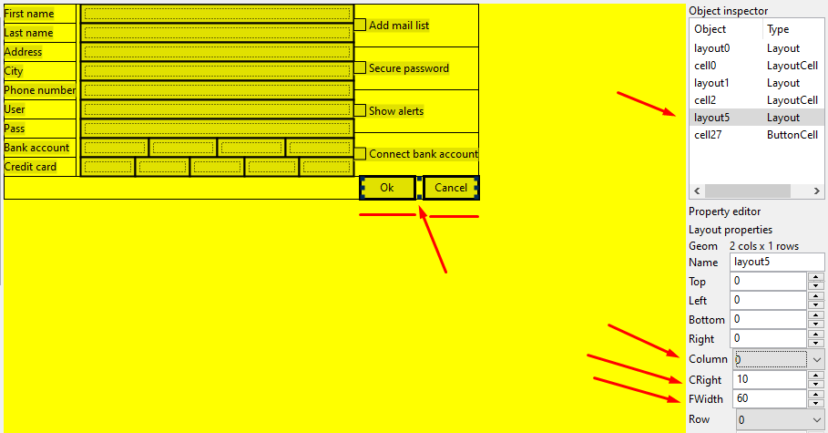
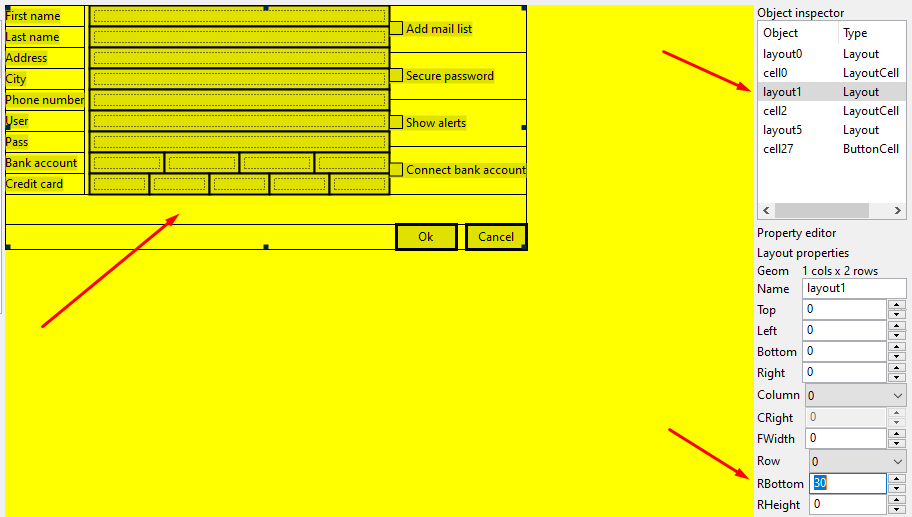
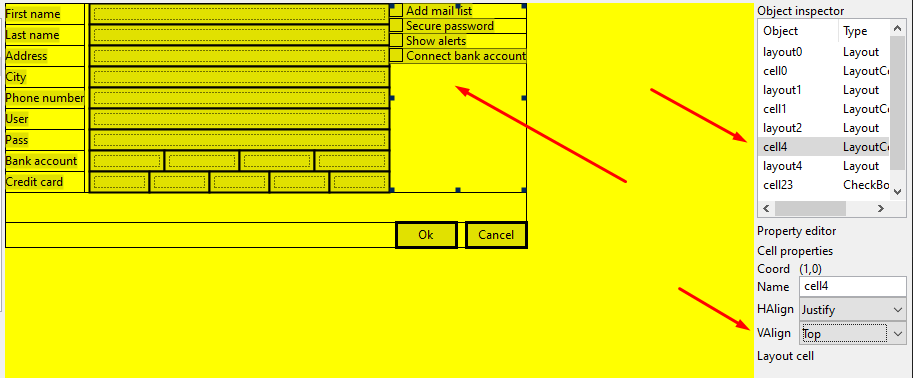
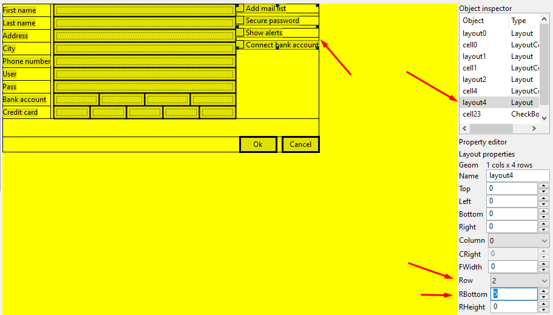
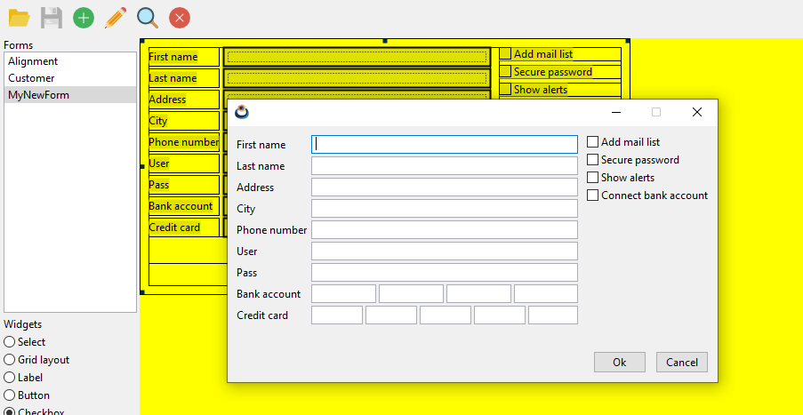

# NAppGUI designer

* [NapDesigner overview](#napdesigner-overview)
* [Build NapDesigner](#build-napdesigner)
* [Open project folder](#open-project-folder)
* [Create a new form](#create-a-new-form)
    - [Space subdivision. Adding cells](#space-subdivision-adding-cells)
    - [Adding widgets](#adding-widgets)
    - [Margins and maximum size](#margins-and-maximum-size)

NAppGUI Designer is a visual tool for designing user interfaces (forms) graphically and interactively. These forms will be saved in files that can be loaded at runtime from Harbour, using GTNAP. It has been developed using NAppGUI-SDK and the forms it generates also use NAppGUI to run within the final application (https://nappgui.com).

## NapDesigner overview

In principle, the appearance of the application is very similar to that of other similar tools (QTDesigner, for example). In the central part we will have the design area where we view the form under construction. On the left we have a list of files and a widget selector. On the right we have the object inspector and the properties editor. At the top we will see the typical toolbar for file management and a status bar at the bottom.


## Build NapDesigner

NapDesigner is distributed as part of GTNAP, so you don't have to do anything special to compile it, just run the build script in `contrib\gtnap`. More information in [Build GTNAP](../Readme.md#build-gtnap)

```
cd contrib/gtnap

:: Windows MinGW
build.bat -b [Debug|Release] -comp mingw64

:: Linux/macOS
bash ./build.sh -b [Debug|Release]
```
The application executable can be found at `build/[Debug|Release]/bin/napdesign`.

## Open project folder

The first time the application starts we will have a blank drawing area and all the buttons are off. The first thing we have to do is click on the folder icon (📁) and select a project directory. NapDesigner allows you to edit all the forms in said directory simultaneously. You can use the example forms in `/contrib/gtnap/tests/cuademo/forms`. We can see the current folder by placing the mouse over the icon. By clicking on any file, we will select it and see it in the drawing area.


## Create a new form

Once the project folder is open, by pressing the button (⊕︎) we will create a new form. After assigning a name, we will see a small rectangle in the drawing area that represents a single cell layout.


NAppGUI is based on the concept of Layout (GridLayout in QtDesigner) which will divide the space into a grid of **ncols** x **nrows** cells. The difference with other SDKs is that NAppGUI **does not support floating elements**. All widgets must be inside a cell in a layout. As we will see below, the main advantage of this is that **it is not necessary to set the frame** (position and size) of each element, since it will be automatically calculated by NAppGUI based on the native API (Win32, GTK, Cocoa).

### Space subdivision. Adding cells

From here we will have to subdivide this first cell using the _Grid Layout_ component of the widget selector. Depending on the layout of the panel we are editing, we will make one or other subdivisions.

* Select _Grid Layout_, click on the cell. A dialog will appear, where you select **Columns: 1, Rows: 2, [OK]**.

    

* We see that in the _Object Inspector_ a hierarchy (path) of Layouts and Cells is being formed.

    

    * **layout0:** Main layout composed of (1x1) cell.
    * **cell0:** Cell [0,0] of layout0.
    * **layout1:** Layout of (1x2) cells located in cell0 (position [0,0] of layout0).
    * **cell2:** Cell (0,0) of layout1, currently empty.
    * We will delve deeper into the _Object Inspector_ later. For the moment, we are observing how the panel changes as we make subdivisions.

* Keeping _Grid Layout_ in the widget selector, we click on the top cell and select: **Columns: 2, Rows: 1, [OK]**.

    

* In the upper left cell, we create a grid with 2 columns and 9 rows.

    

* In the cell on the right 1 column and 4 rows.

    

* And finally, in the bottom cell, 2 columns and 1 row. With this, we have reached the necessary cell configuration for our form. Let's start inserting content.

    

### Adding widgets

* Select _Label_ in the widget selector. Starting with the top left cell, let's create labels for the nine cells on the left: `First Name`, `Last Name`, `Address`, `City`, `Phone number`, `User`, `Pass`, `Bank account` and `Credit card`. You will see how the wider texts will move the rest of the cells to the right. This is an effect of the automatic layout performed by NAppGUI.

    

* Select _Editbox_ in the widget selector. We are going to add a component for each cell to the right of the texts, except for `Bank account` and `Credit card`. For now, use the default options when creating Editboxes.

    

* In the case of `Bank account` and `Credit card` we want to separate the entry into different Editboxes. Select _Grid layout_ again in the widget selector and create 4 columns and 1 row for the `Bank account` and 5 columns for the `Credit card`. You will notice that the form expands horizontally, for now do not worry about this.

    

* Adds an _Editbox_ for each cell of the `Bank account` and `Credit card`.

    

* Select _Button_ in the widget selector and add two buttons `[OK]` and `[Cancel]` in the bottom two cells.

    

* Finally select _Checkbox_ in the widget selector and create 4 checks in the remaining cells on the right:

    * `Add mail list`.
    * `Secure password`.
    * `Show alerts`.
    * `Connect bank account`.

    

* To conclude, press the button (🔍) _Simulate current form_ to check how our form works, with the design we have so far.

    

### Margins and maximum size

While our form is fully functional, it is not very aesthetic. Let's give it some formatting to improve its appearance.

* In the _Object inspector_ select _layout3_, which corresponds to the layout of 2 columns and 9 rows that we added before. In the _Property editor_ select **Column 1** and set the **FWidth** (forced width) property to 300. This "forces" the maximum width of column 1 of the layout to 300 pixels. Interior controls adjust automatically.

    

* Now we are going to leave a small separation between the _Label_ column and the _Editbox_ column. We continue in _layout3_, select **Column 0** and **CRight** to 5. This forces a separation of 5 pixels to the right of column 0. As you can see, you do not have to adjust the position of the Editboxes with the mouse . NAppGUI recalculates the entire design based on the changes we make.

    

* Now select the _cell2_ component, which is the bottom cell that contains a layout with the two buttons. In the _Property editor_ we see that the cell properties appear, where we see the label **Layout cell**. This means that in this cell we do not have a widget, but rather a layout (grid) of 2 columns and 1 row with the two buttons. We changed the **HAlign** property to **Right** (instead of Justify). We will see that both buttons align to the right. By default, when a cell contains a sub-layout the content expands to fill the entire cell space.

    

* Select _layout5_ (the grid with the two buttons). In **Column 0** set **FWidth** to 60 and **CRight** to 10. And in **Column 1**, **FWidth** to 60. This will slightly increase the default width of the buttons and will leave a separation between them of 10 pixels.

    

* Select _layout1_, **Row 0**, **RBottom** 30. This forces a vertical separation between the data area and the buttons.

    

* Let's now go to _cell4_, which is the cell that contains the sublayout with the 4 _Checkbox_. In **VAlign** we select **Top**. With this we manage to group all the _Checkbox_ at the top of the cell.

    

* To leave some separation between the _Checkboxes_, select _layout4_ and, for **Row 0**, **Row 1** and **Row 2** set **RBottom** to 5.

    

* Now, in _layout2_, **Column 0**, **CRight** 10, which will leave a horizontal separation of 10 pixels between the _Editbox_ and the _Checkbox_.

    

* We want to leave a small vertical separation of 3 pixels between each _Label_/_Editbox_ row. Select _layout3_, **Row 0-7**, **RBottom** 3.

    

* And another three horizontal pixels between each _Editbox_ of the `Bank account` and `Credit card`. Select _layout7_, **Column 0-3**, **CRight** 3 for `Credit card`.

    

* And finally we are going to establish a border for the entire form of 10 pixels. Select _layout0_ and set the **Top**, **Left**, **Bottom**, **Right** properties to 10.

    

* Press the icon (🔍) _Simulate current form_ to check the final result.

    
