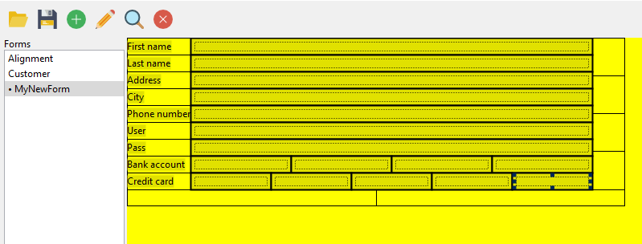

# NAppGUI designer and GTNAP-Forms

NAppGUI Designer es una herramienta visual para diseñar interfaces de usuario (formularios) de forma gráfica e interactiva. Estos formularios se guardarán en archivos que podrán ser cargados en tiempo de ejecución desde Harbour, utilizando GTNAP. Se ha desarrollado utilizando NAppGUI-SDK y los formularios que crea también utilizan NAppGUI para .... dentro de la aplicación final (https://nappgui.com).

## Vista general de NApDesigner

En principio, la apariencia de la aplicación es muy parecida a la de otras herramientas similares (QTDesigner, por ejemplo). En la parte central tendremos el área de diseño donde visualizamos el formulario en construcción. A la izquierda disponemos de una lista de archivos y un selector de widgets. A la derecha tenemos el inspector de objetos y el editor de propiedades. En la parte superior veremos la típica barra de herramientas para la gestión de archivos y una barra de estado en la parte inferior.


## Compilar NApDesigner

Designer se distribuye como parte de GTNAP, por lo que no hay que hacer nada especial para compilarla, tan solo correr el script de build en `contrib\gtnap`. Mas información en [Build GTNAP](../Readme.md#build-gtnap)

```
:: Windows MinGW
build.bat -b [Debug|Release] -comp mingw64

:: Linux / macOS
bash ./build.sh -b [Debug|Release]
```
La aplicación la tendremos en `build/[Debug|Release]/bin/napdesign`.

## Abrir carpeta de proyecto

La primera vez que arranca la aplicación tendremos un área de dibujo en blanco y todos los botones apagados. Lo primero que tenemos que hacer es pulsar sobre el icono carpeta (📁) y seleccionar un directorio de proyecto. NApDesigner permite editar simultáneamente todos los formularios de una carpeta determinada. La carpeta actual la podemos ver situando el ratón encima del icono. Haciendo clic sobre cualquier archivo, lo deseccionaremos y veremos en el área de dibujo.


## Crear un nuevo formulario

Una vez abierta la carpeta del proyecto, pulsando el botón (?) crearemos un nuevo formulario. Lo único que veremos es un pequeño rectángulo en el área de dibujo que representa un layout de una sola celda.


NAppGUI basa la composición de interfaces de usuario en el concepto de Layout (GridLayout en QtDesigner) que dividirá el espacio en (ncols x nrows) celdas. La diferencia con otras herramientas es que NAppGUI **no soporta elementos flotantes**. Todos los widgets deben estar dentro de una celda en un layout. Como veremos a continuación, la principal ventaja de esto que **no es necesario establecer el marco** (posición y tamaño) de cada elemento, ya que será calculado automáticamente por NAppGUI en función del API nativo (Win32, GTK, Cocoa).

### Subdivisión del espacio. Añadir celdas

A partir de aquí deberemos sub-dividir esta primera celda utilizando el componente _Grid Layout_ del selector de widgets. En función del diseño que persigamos para nuestro panel haremos unas u otras subdivisiones.

* Selecciona _Grid Layout_, haz clic sobre la celda. Aparecerá un diálogo, donde seleccionados **Columns: 1, Rows: 2, [OK]**.

    

* Vemos que en el _Object Inspector_ se va formando una jerarquía (camino) de Layouts y Cells.

    

    * **layout0:** Layout principal compuesto de (1x1) celda.
    * **cell0:** Celda [0,0] de layout0.
    * **layout1:** Layout de (1x2) celdas ubicado en cell0 (posición [0,0] de layout0).
    * **cell2:** Celda (0,0) de layout1, por el momento vacía.
    * Profundizaremos más adelante en el _Object Inspector_. Por el momento, vamos observando como cambia el panel a medida que realizamos subdivisiones.

* Manteniendo _Grid Layout_ en el selector de widgets, hacemos click sobre la celda superior y seleccionamos: **Columns: 2, Rows: 1, [OK]**.

    

* En la celda superior izquierda, creamos un grid de 2 columnas y 9 filas.

    

* En la celda de la derecha 1 columna y 4 filas.

    

* Y, por último, en la celda inferior, 2 columnas y 1 fila. Con esto, hemos alcanzado la configuración de celdas necesaria para nuestro formulario. Vamos a empezar a insertar contenido.

    

### Añadir Widgets

* Selecciona _Label_ en el selector de widgets. Empezando por la celda superior izquierda, vamos a crear etiquetas para las nueve celdas de la izquierda: `First Name`, `Last Name`, `Address`, `City`, `Phone number`, `User`, `Pass`, `Bank account` y `Credit card`. Verás como los textos más anchos desplazarán a la derecha al resto de celdas. Esto es un efecto de la maquetación automática que realizar NAppGUI.

    

* Selecciona _Editbox_ en el selector de widgets. Vamos a añadir un componente para cada celda a la derecha de los textos, excepto para `Bank account` y `Credit card`. Por el momento, utiliza las opciones por defecto al crear los Editbox.

    

* Para el caso del `Bank account` y `Credit card` queremos separar la entrada en diferentes Editbox. Vuelve a seleccionar _Grid layout_ en el selector de widgets y crea 4 columnas y 1 fila para el `Bank account` y 5 columnas para el `Credit card`. Observarás que el formulario se va expandiendo horizontalmente, por el momento no te preocupes por esto.

    

* Añade un _Editbox_ por cada celda del `Bank account` y `Credit card`.

    

* Selecciona _Button_ en el selector de widgets y añade dos botones `[OK]` y `[Cancel]` en las dos celdas inferiores.

    

* Por último selecciona _Checkbox_ en el selector de widgets y crea 4 checks en las celdas restantes de la derecha:
    * `Add mail list`.
    * `Secure password`.
    * `Show alerts`.
    * `Connect bank account`.

    

* Para concluir pulsa el botón (🔍) _Simulate current form_ para comprobar el funcionamiento de nuestro formulario hasta ahora.

    

