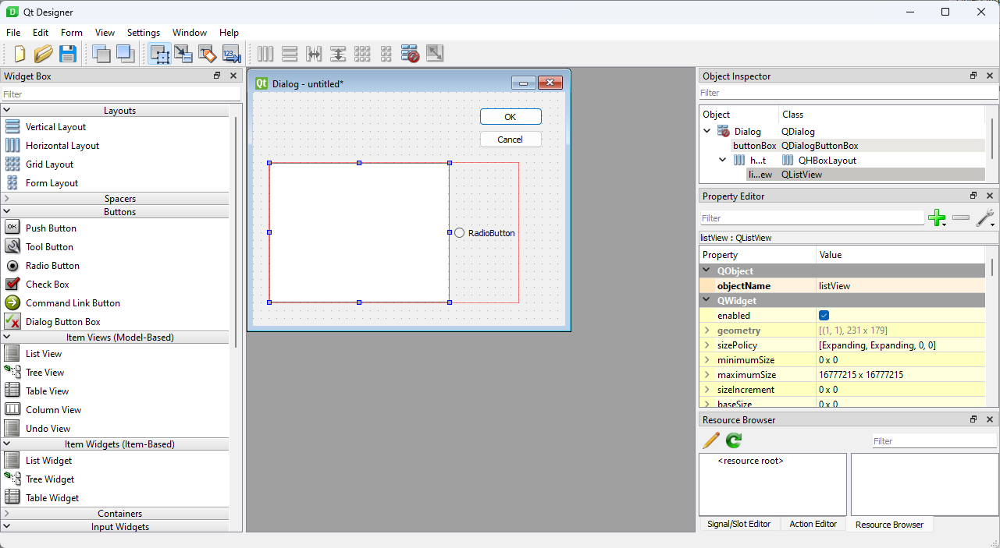
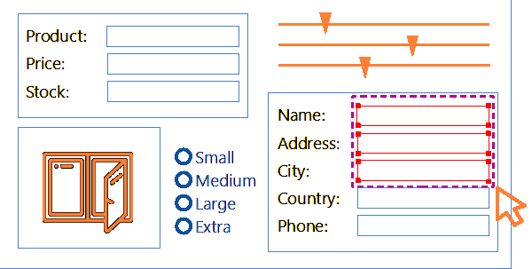
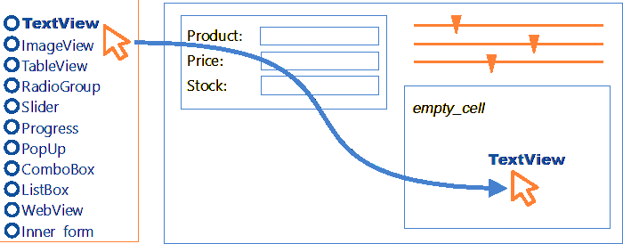
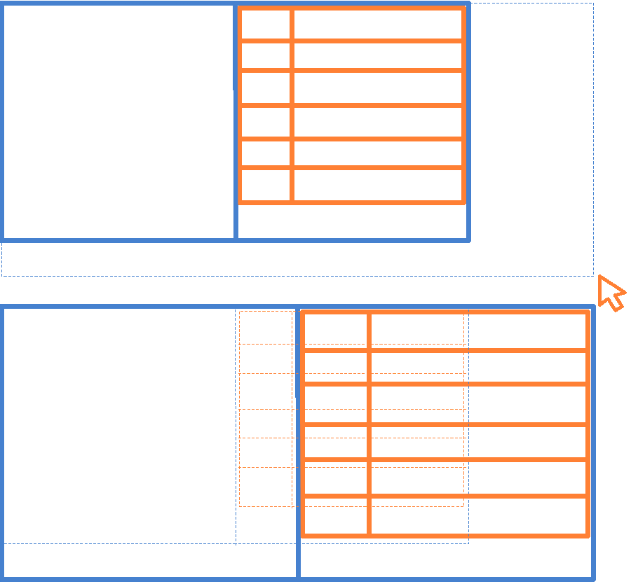

# GTNAP Designer

El objetivo de este documento es realizar una introducción y primera planificación de la herramienta GTNAP-Designer para el diseño visual de formularios y ventanas. En principio, esta herramienta pretende ser un "clon" del QT-Designer con algunas diferencias:

* GTNAP-Designer creará formularios compatibles con NAppGUI-SDK.
* Se podrán exportar los resultados a un archivo `.prg`, en lenguaje **Harbour**, por tanto, compilable por `hbmk2`.
* Los formularios generados serán multiplataforma (Windows, macOS, Linux) y respetarán el _look&feel_ nativo de cada sistema: Colores, Tipografías, Temas, etc.

> **Importante:** En este documento se ha intentado realizar una estimación a futuro de todo el desglose de tareas y tiempos que se requerirán para completar con éxito el proyecto. Estos plazos pueden verse afectados por decisiones que se vayan tomando sobre la marcha, a medida que el proyecto se está desarrollando.

**QT-Designer**



**GTNAP-Designer**


## Planificación

El desarrollo de una herramienta de este tipo goza de cierta dificultad y es fácil de incurrir en retrasos y callejones sin salida por no delimitar bien los objetivos y funcionalidades. Por esta razón dividiremos el desarrollo en diferentes fases:

* Operativa básica (12 Sprints).
* Componentes avanzados (12 Sprints).
* Funciones avanzadas de edición (9 Sprints).
* Formularios redimensionables (5 Sprints).

## Fase 1: Operativa básica

> **Importante** En esta fase se creará una versión inicial y básica de la herramienta, con limitadas funcionalidades de edición. El principal objetivo será poder componer formularios básicos y exportarlos a Harbour.

Tras concluir esta fase tendremos:

* Aplicación de escritorio cuya ventana estará dividida en tres áreas bien delimitadas (igual que QtDesigner):
    * Parte izquierda: Zona widgets, donde están los elementos que podemos utilizar para el diseño.
    * Parte central: Canvas de dibujo. Donde diseñaremos los formularios.
    * Parte derecha: Inspector de objetos y propiedades.

* Elementos incluidos en fase 1:
    * Layout (GridLayout de momento). El grid permite crear VerticalLayout y HorizontalLayout.
    * Label.
    * Button.
    * CheckBox.
    * EditBox.

* Editor multi-formulario. En lugar de cargar formularios uno a uno, el editor permitirá tener varios archivos abiertos y alternar entre ellos. Algo así como la opción "open folder" de algunos editores que cargará a la vez todos los formularios existentes en una misma carpeta.

* Archivo de diseño **(.ui)**. Archivo con el diseño del formulario que puede abrirse con el editor. Seguramente en formato JSON.

* Exportar a Harbour. Generar un archivo **.prg** con el código Harbour capaz de crear el formulario en tiempo de ejecución.

* Comunicación con el formulario: La aplicación final debe ser capaz de acceder al formulario en tiempo de ejecución: Detectar si se ha pulsado un botón, obtener el texto de un EditBox, etc.

**Diseño de GTNAP-Designer (Fase 1)**


### Fase 1: Estimación de Sprints (12)

* **Sprint 1:** Crear el cuerpo de la aplicación. Ventanas, paneles, layouts y controles.

* **Sprint 2:** Crear en el canvas la jerarquía de layouts y sublayouts.

* **Sprint 3:** Añadir Label al canvas. Aquí se implementará código común para interactuar con los diferentes controles.

* **Sprint 4:** Añadir Button y CheckBox al canvas.

* **Sprint 5:** Añadir EditBox al canvas.

* **Sprint 6:** Poder grabar en disco los diseños. Lista de formularios.

* **Sprint 7:** Object Inspector. Reflejar la jerarquía de objetos en el panel de la derecha.

* **Sprint 8:** Property Editor. Poder editar el objeto seleccionado en el Object Inspector.

* **Sprint 9:** Exportar a Harbour .prg (1). Generar código Harbour compilable a partir del diseño del formulario. Este código reproducirá el formulario en tiempo de ejecución.

* **Sprint 10:** Exportar a Harbour .prg (2). Es posible que esta tarea ocupe dos sprints.

* **Sprint 11:** Integración runtime con Harbour (1). Aquí se definirá una librería para poder interactuar con los formularios en tiempo de ejecución. Por ejemplo:
    ```
    // This function is defined in the .prg
    // automatically generated by GTNAP-Designer
    O_Form := NAP_ASPECT_CUSTOMER_DATA_FORM()

    // These functions are defined in GTNAP-FORMS library
    // and used in the application for interact with the form.
    NAP_FORM_ON_BUTTON_CLICK(O_Form, "button1", {|| ShowMessage("Clicked")})
    NAP_FORM_GET_EDIT_TEXT(O_Form, "editCustomerName", @C_CustomerName)
    ```

* **Sprint 12:** Integración runtime con Harbour (2). Es posible que esta tarea ocupe dos sprints.

## Fase 2: Componentes avanzados

En esta fase ampliaremos el catálogo de widgets. Aprovecharemos la implementación básica para enriquecer los formularios con controles adicionales:

* Control TextView. Para editar textos largos y, opcionalmente, aplicar formatos (Fuente, negrita, tamaños, etc). [Link](https://nappgui.com/en/gui/textview.html).

* Control ImageView. Poder insertar imágenes en los formularios. [Link](https://nappgui.com/en/gui/imageview.html).

* Control TableView. Añadir tablas y configurar sus columnas (ancho, redimensión, cabecera, etc). [Link](https://nappgui.com/en/gui/tableview.html).

* Control TreeView. Añadir a la tabla la capacidad de trabajar con árboles.

* Radio Group. Conjunto de radio botones, donde solo uno de ellos puede estar seleccionado. [Link](https://nappgui.com/en/gui/button.html#h1).

* Control Slider y Progress. [Link](https://nappgui.com/en/gui/slider.html). [Link](https://nappgui.com/en/gui/progress.html).

* Control PopUp. Botón con menú desplegable. [Link](https://nappgui.com/en/gui/popup.html).

* Control ComboBox. Cuadro de edición con menú desplegable. [Link](https://nappgui.com/en/gui/combo.html).

* Control ListBox. Cuadro de lista con iconos y/o checkbox opcionales. [Link](https://nappgui.com/en/gui/listbox.html).

* Control WebView. Vista Web. [Link](https://nappgui.com/en/gui/webview.html).

* Formularios interiores. Poder integrar un formulario previamente diseñado como parte de otro formulario más grande.

* Vista de dibujo y vista OpenGL. **Por el momento NO IMPLEMENTADOS**. Habría que estudiar como implementar el API de dibujo en Harbour. [Link](https://nappgui.com/en/gui/view.html). [Link](https://nappgui.com/en/ogl3d/ogl3d.html).

**Todos los widgets (Fase 1 y fase 2)**


**Formularios interiores**


### Fase 2: Estimación de Sprints (12)

* **Sprint 1:** Implementación del TextView. Añadir control, añadir soporte al archivo **(.iu)** y al exportador de Harbour.

* **Sprint 2:** Implementación del ImageView. Añadir control, añadir soporte al archivo **(.iu)** y al exportador de Harbour.

* **Sprint 3 y 4:** Implementación del TableView. Añadir control, añadir soporte al archivo **(.iu)** y al exportador de Harbour. Este componente es más complicado de integrar, debido a la configuración de las columnas.

* **Sprint 5:** Radio buttons. Se generan en grupo (mínimo 2) con su propio layout horizontal o vertical. Añadir controles, añadir soporte al archivo **(.iu)** y al exportador de Harbour.

* **Sprint 6:** Sliders y progress. Añadir controles, añadir soporte al archivo **(.iu)** y al exportador de Harbour.

* **Sprint 7:** Popup. Añadir control, añadir soporte al archivo **(.iu)** y al exportador de Harbour.

* **Sprint 8:** ComboBox. Añadir control, añadir soporte al archivo **(.iu)** y al exportador de Harbour.

* **Sprint 9:** ListBox. Añadir control, añadir soporte al archivo **(.iu)** y al exportador de Harbour.

* **Sprint 10:** WebView. Añadir control, añadir soporte al archivo **(.iu)** y al exportador de Harbour.

* **Sprint 11 y 12:** Formularios interiores. Posibilidad de seleccionar un formulario previo desde el editor. Añadir control, añadir soporte al archivo **(.iu)** y al exportador de Harbour.

## Fase 3: Funciones avanzadas de edición

Ya con una aplicación totalmente operativa lista para crear y editar cualquier tipo de formulario, nos centraremos en mejorar la usabilidad del programa. Las funcionalidades a implementar en esta fase serán:

* Selección múltiple. Poder seleccionar varios objetos con el ratón o pulsando [Ctrl+click].

* Portapapeles: Copy, Paste, Cut.
    * Copiar en el portapapeles del sistema, los objetos gráficos seleccionados.
    * Definir estructuras de comunicación.
    * Pegar los objetos gráficos en una celda vacía del layout.
    * Copiar y pegar los textos de propiedades (por ejemplo, el texto del botón).
    * Función cut de los objetos seleccionados.
    * Función remove de los objetos seleccionados.

* Undo/Redo: Capacidad de deshacer y rehacer los cambios.
    * Definir que tipos de operaciones pueden ser deshechas.
    * Crear las estructuras de datos del Undo/Redo.
    * Implementación.

* Drag'N'Drop. Poder arrastrar widgets desde la vista izquierda al área del canvas y vincularlos con una celda del layout.
    * Implementar el soporte Drag'N'Drop en Windows, macOS, Linux.
    * Implementar el arrastre de widgets desde el panel izquierdo al canvas.

**Selección múltiple**



**Soporte Drag'N'Drop**



### Fase 3: Estimación de Sprints (9)

* **Sprint 1:** Selección múltiple de objetos.

* **Sprint 2 y 3:** Implementación del portapapeles. Copiar y pegar los objetos seleccionados.

* **Sprint 4, 5, 6:** Undo/Redo.

* **Sprint 7, 8, 9:** Drag'N'Drop support.

## Fase 4: Formularios redimensionables

Hasta ahora, todos los formularios que podemos diseñar tienen un tamaño fijo. Es posible que queramos hacerlos re-dimensionables utilizando el botón de maximizar o arrastrando los bordes de la ventana. Esto exige añadir nuevas propiedades a los layout y sus celdas con el fin de controlar de forma recursiva como se adaptarán los controles al cambio de tamaño. Mas información [Aquí](https://nappgui.com/en/gui/layout.html#h5) y [Aquí](https://nappgui.com/en/demo/die.html#h4).

* Añadir al Property Editor aquellas propiedades necesarias para manejar el cambio de tamaño.

* Crear una "vista previa" capaz de aceptar el redimensionado de la ventana.

* Modificar el archivo **(*.ui)** para que acepte estas nuevas propiedades.

* Modificar el exportador a **(*.prg)** para que genere los formularios re-dimensionables.

* Añadir a la librería GTNAP-Forms las nuevas funciones para manejar el re-dimensionado.

**Redimensionado de formularios**



### Fase 4: Estimación de Sprints (5)

* Sprint 1: Añadir nuevas propiedades al Property Editor.

* Sprint 2: Crear la "vista previa" re-dimensionable.

* Sprint 3: Modificar el **(*.ui)**.

* Sprint 4: Modificar el exportador a **(*.prg)**.

* Sprint 5: Modificar la librería GTNAP-Forms.
